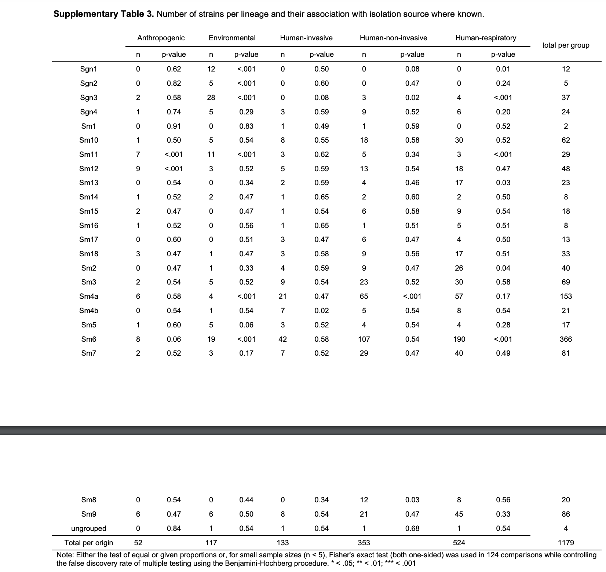
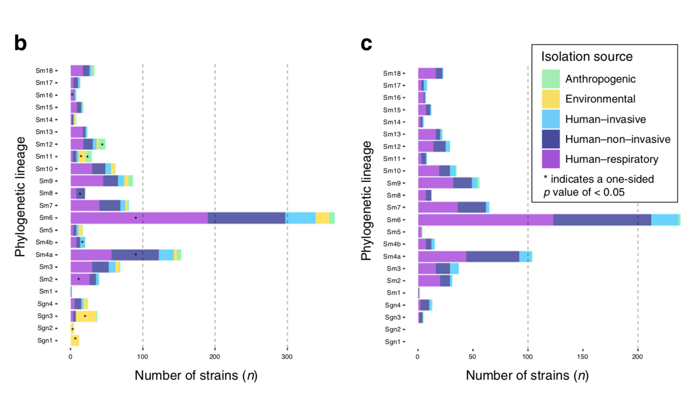

```{r setup, include=FALSE}
knitr::opts_chunk$set(
	echo = TRUE,
	warning = TRUE,
	message = TRUE,
	comment = "##",
	prompt = FALSE,
	tidy = TRUE,
	tidy.opts = list(blank = FALSE, width.cutoff = 75),
	fig.path = "img/",
	fig.align = "center"
)
```

```{r}
library(readxl)
library(tidyverse)
library(cowplot)
library(colorspace)
library(glue)
```


## Introduction

  The paper, *The phylogenetic landscape and nosocomial spread of the multidrug-resistant opportunist Stenotrophomonas maltophilia*, looks at the global population structure and distribution of *S. maltophilia*, a bacteria species that infects humans. The study characterizes different lineages, including data regarding their abundance, antibiotic resistivity, and virulence. The data itself are whole genome sequencing data for 1305 genomes. To divide the genomes into lineages, the authors performed several analyses, including constructing a maximum likelihood phylogeny, Hierarchical Bayesian clustering, and average nucleotide identity analysis. The authors then located known antibiotic resistance and virulence genes in the different strains and used multiple correspondence analysis to correlate the genes with the lineages, origin, and isolation source. Finally, they used single-linkage clustering to group some of the strains into clonal complexes. 
  The authors were able to divide the strains into 23 distinct lineages, 6 of which were previously unknown and nearly all of which were found in each of the 22 countries sampled. They also identified clusters of strains linked to human-to-human transmission in hospitals, and found that strains that infect humans had more antibiotic resistance and virulence genes that strains than were only found in the environment.

```{r}
supp_3 <- read_excel("41467_2020_15123_MOESM7_ESM.xlsx", col_names = TRUE)
head(supp_3)
```
I will try to replicate descriptive statistics for the linkage clustering and the correlation tests between the bacteria strain and isolation source. The visualizations will be the distribution of strains among isolation sources.

## Replications

**Descriptive Statistical Analysis**

Summary statistics for clusters of strains using thresholds of 10 and 100 mismatched alleles for single-linkage clustering.
  
```{r}
# filter for 100 mismatched allele clusters
csize_100 <- supp_3 %>%
  filter(`d100-allele-cluster` != "NA") %>%
  group_by(`d100-allele-cluster`) %>%
  summarise(cluster_size = n())

# calculations
x_strains <- sum(csize_100$cluster_size)
percent <- round(sum(csize_100$cluster_size)/ nrow(supp_3), 2)
num_clusters <- nrow(csize_100)
med <- median(csize_100$cluster_size)
iqr25 <- fivenum(csize_100$cluster_size)[2]
iqr75 <- fivenum(csize_100$cluster_size)[4]

# print results
print(glue("I found {x_strains} ({percent}%) strains to group into {num_clusters} clusters (median cluster size {med}, IQR {iqr25}-{iqr75}) within 100 alleles difference."))

# filter for 10 mismatched allele clusters
csize_10 <- supp_3 %>%
  filter(`d10-allele-cluster` != "NA") %>%
  group_by(`d10-allele-cluster`) %>%
  summarise(cluster_size = n())

# calculations
x_strains <- sum(csize_10$cluster_size)
percent <- round(sum(csize_10$cluster_size)/ nrow(supp_3), 2)
num_clusters <- nrow(csize_10)
med <- median(csize_10$cluster_size)
iqr25 <- fivenum(csize_10$cluster_size)[2]
iqr75 <- fivenum(csize_10$cluster_size)[4]

# print results
print(glue("I found {x_strains} ({percent}%) strains to group into {num_clusters} clusters (median cluster size {med}, IQR {iqr25}-{iqr75}) within 10 alleles difference."))
```

Values from the paper, page 6:

"We found 765 (63%) strains to group into 82 clusters (median cluster size 6, IQR 6–11.7) within 100 alleles difference. A total of 270 (21%) strains were grouped into 62 clusters within 10 alleles difference (median cluster size 4, IQR 3–4.7). The maximum number of strains per cluster were 45 and 12 for the d100 and d10 clusters, respectively."


**Inferential Analysis**

This analysis investigates whether lineages correlate with isolation source. Isolation sources include environmental, anthropogenic (from human surroundings), human-invasive (from human bodily fluids), human non-invasive (from body surfaces), and human-respiratory (from the lower respiratory track). The authors used the test of equal or given proportions to calculate one-sided p-values for the association of the bacteria strains with their isolation source. For sample sizes of less than 5, Fisher's exact test was used and the Benjamini-Hochberg procedure was used to control the false discovery rate.
  
  The null hypothesis that I tried to test is: The five isolation sources have the same true proportion of each lineage. 
```{r}
# preparing the data
table_3 <- supp_3 %>% 
  filter(`isolation source` != "unknown") %>% 
  filter(lineage != "ungrouped") %>%
  group_by(`isolation source`, lineage) %>% 
  summarise(n = n()) %>% 
  pivot_wider(names_from = `isolation source`, values_from = n) %>% 
  arrange(lineage)

# replace NAs with 0 
table_3[is.na(table_3)] = 0

# calculate total samples from each isolation source
table_3$`total per group` <- 0
for (i in 1:nrow(table_3)) {
  table_3[i,7] <- sum(table_3[i, 2:6], na.rm = TRUE)
}

```

```{r}
p_lst <- vector(length = nrow(table_3))

# go through rows and calculate correlation between strain and isolation source
for (i in 1:(nrow(table_3))) {
  
  if (table_3[i, 7] < 5) {
    # fisher's exact test used - row 5
    mx <- matrix(c(1, 2, 0, 2), nrow = 2, byrow = TRUE)
    p <- fisher.test(mx)
  }
  
  else{
    # test of equal or given proportions used
    p <- prop.test(as.integer(unlist(table_3[i,2:6])), rep(as.integer(unlist(table_3[i, 7])), 5), alternative = "greater")$p.value
  }
  p_lst[i] <- p

}

# Benjamini-Hochberg procedure
table_3 <- cbind(table_3, p_value = p.adjust(p_lst, method = "BH"))
```

```{r}
table_3
```

A table with the calculated correlation between the strains and isolation source from the Supplementary Materials (Table 3). The results are described on page 4 of the paper.

```{r echo=FALSE, out.width="70%"}

```


This visualization (Fig 2b and c) depicts a within-lineage comparison of isolation sources. 

```{r}
supp_3$lineage <- as.factor(supp_3$lineage)

table_3 <- supp_3 %>% 
  filter(`isolation source` != "unknown") %>% 
  filter(lineage != "ungrouped") %>%
  group_by(`isolation source`, lineage) %>% 
  summarise(n = n()) %>% 
  arrange(lineage)

table_3 %>%
  # correct the order of labels on y-axis to match publication
  mutate(lineage = fct_relevel(lineage, "Sgn1", "Sgn2", "Sgn3", "Sgn4", "Sm1",  "Sm2",  "Sm3",  "Sm4a", "Sm4b", "Sm5",  "Sm6",  "Sm7", "Sm8",  "Sm9",  "Sm10", "Sm11", "Sm12", "Sm13", "Sm14", "Sm15", "Sm16", "Sm17", "Sm18")) %>%
  ggplot(aes(n, lineage, fill = `isolation source`)) +
    geom_col() +
    theme_minimal_vgrid() +
    # legend colors and labels
    scale_color_manual(
        values = c("light green", "#F0E442", "#56B4E9", "navy blue", "purple"),
        labels = c("Anthropogenic", "Environmental", "Human-invasive", "Human-non-invasive", "Human-respiratory"),
        aesthetics = c("fill")
      ) +
    labs(fill = "Isolation source") +
     # labeling the plot
    ylab("Phylogenetic lineage") +
    xlab(expression(paste("Number of strains ", italic("(n)")))) +
    # customizing legend position, text size
    theme(legend.box.background = element_rect(
      color = "black"
      ),
      legend.box.margin = margin(7, 7, 7, 7),
      legend.position = c(.64, .8), 
      axis.text = element_text(size = rel(.5)))
```

Figure 2c, showing the strains associated with only human sources.

```{r}
# filter input data
fig2c <- supp_3 %>% 
  filter(`isolation source` != "unknown") %>% 
  filter(lineage != "ungrouped") %>%
  group_by(`isolation source`, lineage) %>% 
  summarise(n = n()) %>% 
  arrange(lineage)

# remove non-human isolation sources
for (i in 1:nrow(fig2c)) {
  if (fig2c[i, 1] %in% c("environmental", "anthropogenic")) {
    fig2c[i, 3] <- 0
  }
}

fig2c %>%
  # correct the order of labels on y-axis to match publication
  mutate(lineage = fct_relevel(lineage, "Sgn1", "Sgn2", "Sgn3", "Sgn4", "Sm1",  "Sm2",  "Sm3",  "Sm4a", "Sm4b", "Sm5",  "Sm6",  "Sm7", "Sm8",  "Sm9",  "Sm10", "Sm11", "Sm12", "Sm13", "Sm14", "Sm15", "Sm16", "Sm17", "Sm18")) %>%
  ggplot(aes(n, lineage, fill = `isolation source`)) +
    geom_col() +
    theme_minimal_vgrid() +
    # legend colors and labels
    scale_color_manual(
        values = c("light green", "#F0E442", "#56B4E9", "navy blue", "purple"),
        labels = c("Anthropogenic", "Environmental", "Human-invasive", "Human-non-invasive", "Human-respiratory"),
        aesthetics = c("fill")
      ) +
    labs(fill = "Isolation source") +
     # labeling the plot
    ylab("Phylogenetic lineage") +
    xlab(expression(paste("Number of strains ", italic("(n)")))) +
    # customizing legend position, text size
    theme(legend.box.background = element_rect(
      color = "black"
      ),
      legend.box.margin = margin(7, 7, 7, 7),
      legend.position = c(.64, .8), 
      axis.text = element_text(size = rel(.5)))
```

Figure 2, parts b and c from the paper.
```{r echo=FALSE, out.width="70%"}

```

## Summary/Discussion

There were many different data files, and it was difficult to associate each one with the respective analyses performed, and in what order. This was particularly in respects to other analyses that I looked at, including the phylogenetic tree construction. I would have liked to replicate the multiple correspondence analysis, but could not find the correct source data. Two files were mentioned in relation to the MCA, but they did not contain the input or output variables mentioned in the paper.

In the data file I used, the number of clusters in the file and described in the paper is different. The data file is missing 5 clusters in the 100 allele difference group, while there are three more clusters in the 10 allele difference group than mentioned in the paper. The descriptive statistics calculated were still fairly similar, but the differences could be explained by the missing data.

I was able to find the data related to the inferential analysis of the correlation between the strains and their isolation sources. The statistical tests for this analysis (test of equal or given proportions and Fisher's exact test with Benjamini-Hochberg procedure) were mentioned in the paper, along with the calculated p-values. However, that was the extent of the detail given, and after trying several different combinations I could not determine the input that gave the p-values in the paper. I also did not know whether to use "greater" or "less" to specify the alternative hypothesis because the test was one-sided. The test of equal or given proportions only returns one p-value when comparing across multiple isolation groups for a strain. Alternatively, if the authors had run the test to compare the number of strains in a particular group vs the total number for the strain, this would return as many p-values as displayed in the paper (Supplementary Table 3). However, the numbers recorded do not correspond to this procedure either, as observations with the same proportions are shown in the paper to have different p-values. 

The visualization for Figure 2b and 2c from the paper went fairly well, with the exception of the p-values that were supposed to be on 2b. For 2c in the paper, which focused only on human-associated isolation sources, the x-axis shrank in relation to 2b and I could not tell if that was because the authors removed strains from the visualization.

## Reference

Gröschel, M.I., Meehan, C.J., Barilar, I. et al. The phylogenetic landscape and nosocomial spread of the multidrug-resistant opportunist Stenotrophomonas maltophilia. Nat Commun 11, 2044 (2020). https://doi.org/10.1038/s41467-020-15123-0
